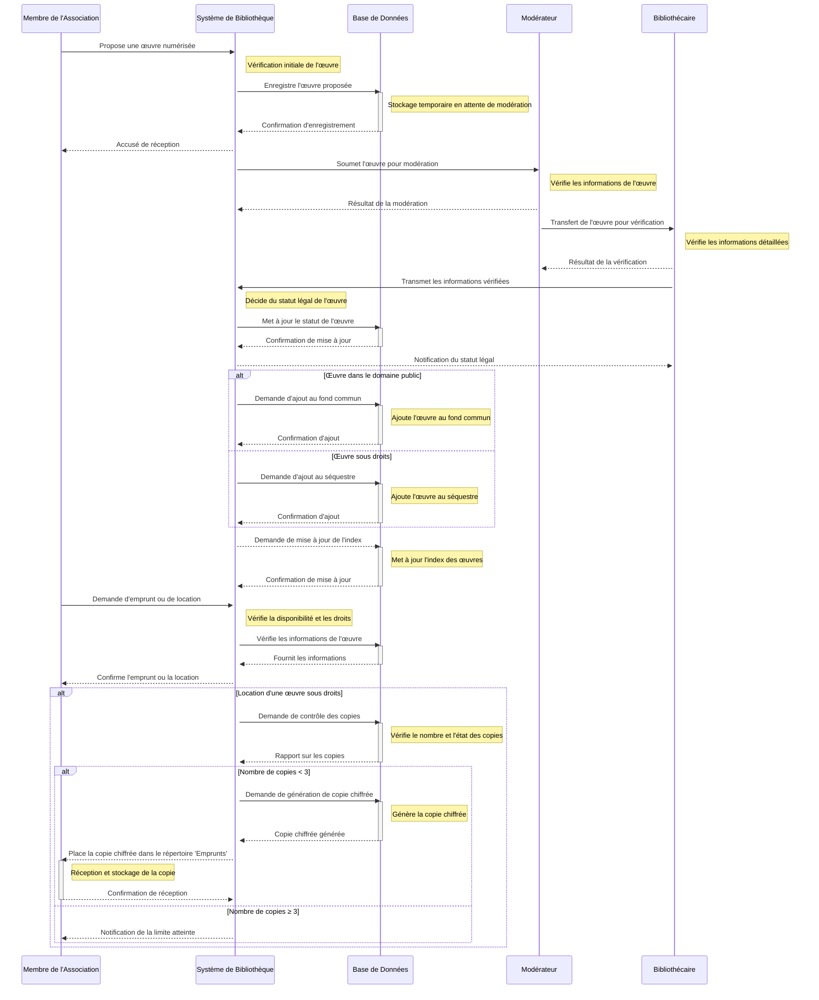

# Logiception
## Résumé en 1 phrase :
Conception D'une bibliothèque numérique décentralisée.
## Description du projet :
Le projet de CultureDiffusion consiste à développer une bibliothèque numérique où les membres peuvent numériser et partager des œuvres, avec une gestion décentralisée permettant un accès gratuit aux œuvres du domaine public et une location de deux semaines pour les œuvres sous droits d'auteur, soutenue par une structure de fichiers et une modération collaborative pour enrichir et maintenir la collection.

## Sommaire

[**Glossaire**](./glossaire.md)  
[**Scénario**](./Scenario)  
[**Suivi**](./suivi.md)  

## Diagramme de séquence du logiciel : 

