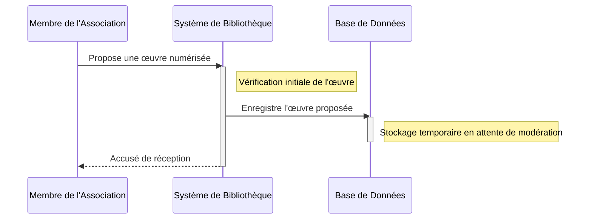
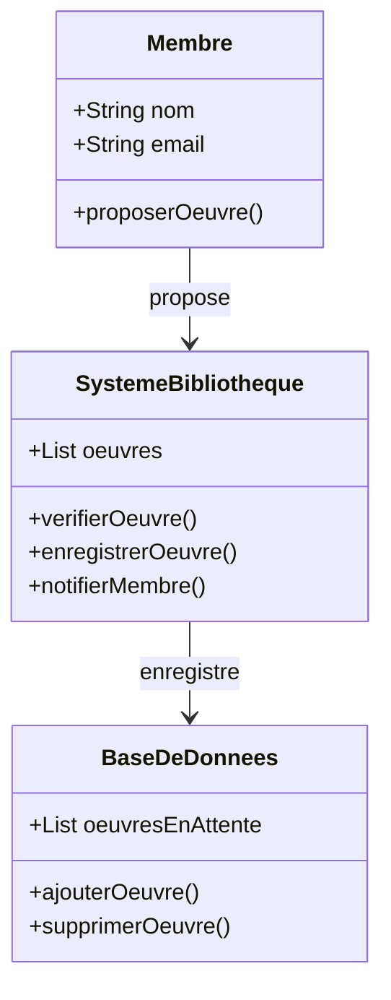

# Un membre de l'association numérise une œuvre et la propose à la bibliothèque.

## Description du Scénario : Numérisation et Proposition d'Œuvre

### Acteurs Impliqués :
1. **Membre de l'Association** : Celui qui numérise et propose l'œuvre.
2. **Système de Bibliothèque** : Plateforme numérique gérant les propositions et les enregistrements des œuvres.
3. **Base de Données** : Stocke les informations détaillées des œuvres et gère leur statut.

### Processus :
1. **Numérisation de l'Œuvre** :
   - Le Membre numérise une œuvre (livre, document, etc.).
   - Il crée un fichier numérique de l'œuvre et un fichier JSON contenant les informations de base sur l'œuvre (titre, auteur, etc.).

2. **Proposition de l'Œuvre** :
   - Le Membre se connecte au Système de Bibliothèque.
   - Il soumet la proposition de l'œuvre en téléchargeant le fichier numérique et le fichier JSON.

3. **Enregistrement de la Proposition** :
   - Le Système de Bibliothèque reçoit la proposition et enregistre les fichiers.
   - Le Système vérifie si l'œuvre est déjà présente dans la base de données.

4. **Mise à Jour de la Base de Données** :
   - Si l'œuvre est nouvelle, le Système de Bibliothèque envoie les informations à la Base de Données pour enregistrement.
   - La Base de Données crée un nouvel enregistrement pour l'œuvre avec son statut initial (en attente de modération).

### Diagramme de Séquence :
- Les interactions commencent avec le Membre qui envoie la proposition au Système de Bibliothèque.
- Le Système de Bibliothèque interagit avec la Base de Données pour vérifier et enregistrer l'œuvre.

### Diagramme de Classe :
- **Classe Membre** : Contient des méthodes pour numériser et soumettre l'œuvre.
- **Classe Système de Bibliothèque** : Gère la réception des propositions et communique avec la Base de Données.
- **Classe Base de Données** : Stocke les informations des œuvres et gère leur statut.

### Points Clés pour le Codage des Diagrammes :
- Assurez-vous que les interactions entre le Membre, le Système de Bibliothèque et la Base de Données sont clairement représentées.
- Dans le diagramme de classe, chaque classe doit avoir des attributs et des méthodes pertinents pour leur rôle spécifique dans le scénario.
- Le diagramme de séquence doit refléter l'ordre chronologique des étapes du processus.

## Diagramme de séquence 

## Diagramme de classe 

