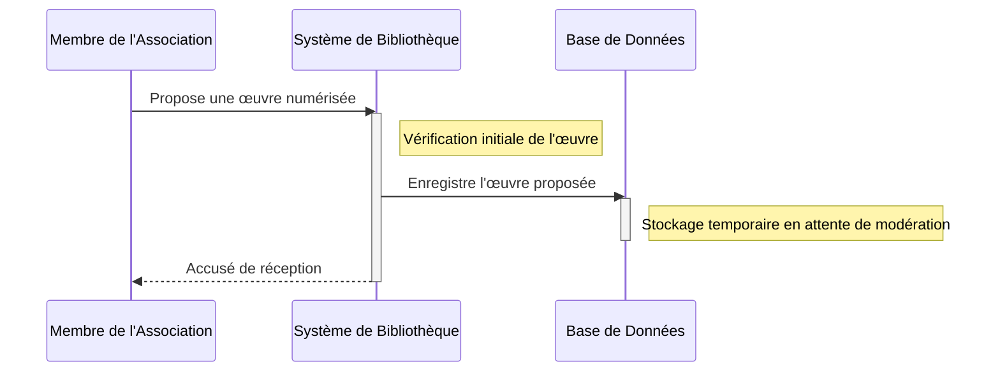
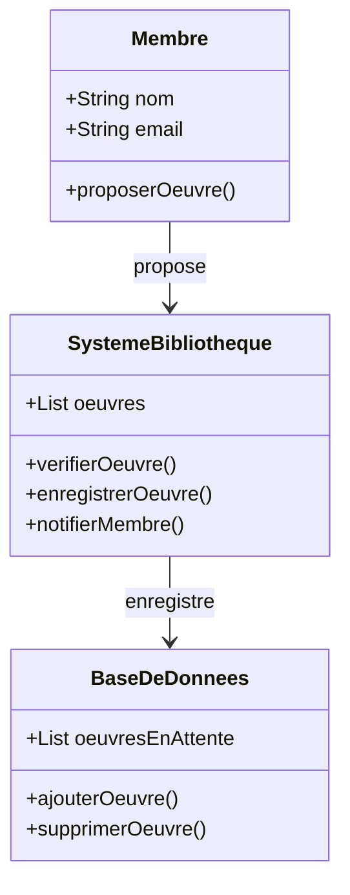

# Un membre de l'association numérise une œuvre et la propose à la bibliothèque.

## Description du Scénario : Numérisation et Proposition d'Œuvre avec Interface Interactive

### Acteurs Impliqués :
1. **Membre de l'Association** : Celui qui numérise et propose l'œuvre.
2. **Système de Bibliothèque avec Interface Interactive** : Plateforme numérique facilitant les propositions et les enregistrements des œuvres.
3. **Base de Données** : Stocke les informations détaillées des œuvres et gère leur statut.

### Processus :
1. **Numérisation de l'Œuvre** :
   - Le Membre numérise une œuvre (livre, document, etc.).
   - Il crée un fichier numérique de l'œuvre.

2. **Proposition de l'Œuvre via l'Interface Interactive** :
   - Le Membre se connecte au Système de Bibliothèque.
   - Il choisit l'option de proposition d'une nouvelle œuvre.
   - L'Interface Interactive le guide à travers un formulaire :
     - **Téléchargement du Fichier Numérique** : Le Membre télécharge le fichier numérique de l'œuvre.
     - **Informations de l'Œuvre** : Le Membre répond à des questions interactives pour remplir les informations de base sur l'œuvre (titre, auteur, année de publication, genre, etc.). Ces informations sont automatiquement converties en un format structuré interne par le système.

3. **Enregistrement de la Proposition** :
   - Le Système de Bibliothèque reçoit la proposition et enregistre le fichier numérique ainsi que les informations saisies.
   - Le Système vérifie si l'œuvre est déjà présente dans la base de données.

4. **Mise à Jour de la Base de Données** :
   - Si l'œuvre est nouvelle, le Système de Bibliothèque envoie les informations à la Base de Données pour enregistrement.
   - La Base de Données crée un nouvel enregistrement pour l'œuvre avec son statut initial (en attente de modération).

### Diagramme de Séquence :
- Les interactions commencent avec le Membre qui utilise l'Interface Interactive du Système de Bibliothèque pour remplir les informations de l'œuvre et soumettre la proposition.
- Le Système de Bibliothèque vérifie si l'œuvre est déjà présente dans la Base de Données, puis procède à l'enregistrement si l'œuvre est nouvelle.

### Diagramme de Classe :
- **Classe Membre** :
  - Attributs : `identifiantMembre`, `fichierOeuvre`
  - Méthodes : `numériserOeuvre()`, `soumettreOeuvre()`
- **Classe Système de Bibliothèque** :
  - Méthodes : `verifierOeuvreExistante()`, `enregistrerNouvelleOeuvre()`
  - Gère les interactions avec l'Interface Interactive et communique avec la Base de Données.
- **Classe Base de Données** :
  - Attributs : `listeOeuvres`
  - Méthodes : `ajouterOeuvre()`, `verifierExistenceOeuvre()`
  - Stocke les informations des œuvres et gère leur statut.

### Points Clés pour le Codage des Diagrammes :
- Assurez-vous que les interactions entre le Membre, l'Interface Interactive, le Système de Bibliothèque, et la Base de Données sont clairement représentées.
- Chaque classe dans le diagramme de classe doit avoir des attributs et des méthodes pertinents pour leur rôle spécifique dans le scénario.
- Le diagramme de séquence doit refléter l'ordre chronologique des étapes du processus et montrer les flux de données entre les classes.
- Représentez les dépendances et les relations entre les classes, comme l'héritage ou les associations.

## Diagramme de séquence 

## Diagramme de classe 

## Explication technique du scénario 

La base de données de notre système de bibliothèque est construite en utilisant MongoDB, une base de données NoSQL flexible qui est idéale pour stocker des documents numérisés et leurs métadonnées. Grâce à sa capacité à gérer de grands volumes de données et à sa structure de données en forme de documents, MongoDB permet une organisation et une récupération efficaces des œuvres numérisées. Pour la numérisation, nous utilisons une application dédiée qui facilite la conversion de documents physiques en formats numériques, tout en conservant leur intégrité et leur lisibilité.

L'interface utilisateur est conçue de manière intuitive pour guider le membre de l'association tout au long du processus de numérisation et de soumission. Cette interface, développée avec un framework moderne comme React ou Vue.js, offre une expérience utilisateur fluide et réactive. Lors de la soumission d'une œuvre, l'utilisateur est invité à remplir un formulaire dynamique où il saisit les informations clés comme le titre, l'auteur, l'année de publication et le genre. Cette saisie est assistée par des suggestions automatiques et des validations pour assurer l'exactitude des données.

Une fois l'œuvre numérisée et les informations saisies, elles sont envoyées au système de bibliothèque via une API RESTful, implémentée en Node.js. Cette API sert de pont entre l'interface utilisateur et la base de données, traitant les requêtes, effectuant des vérifications préliminaires et enregistrant les données dans MongoDB. Le système vérifie d'abord si l'œuvre existe déjà pour éviter les doublons, puis stocke l'œuvre avec un statut initial 'en attente de modération'. Un système de notification intégré informe ensuite le membre de l'association de la réception de sa proposition.

Pour assurer la sécurité et la performance, le système utilise des technologies de cache comme Redis, et des protocoles de sécurité robustes pour protéger les données des utilisateurs et les œuvres numérisées. La mise en œuvre de cette architecture technique garantit un système fiable et efficace pour la gestion de la bibliothèque numérique décentralisée.
