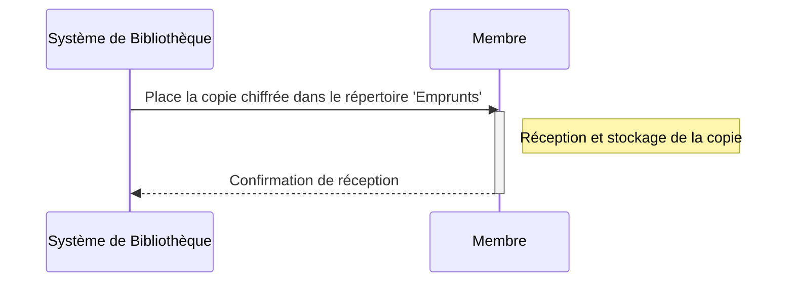
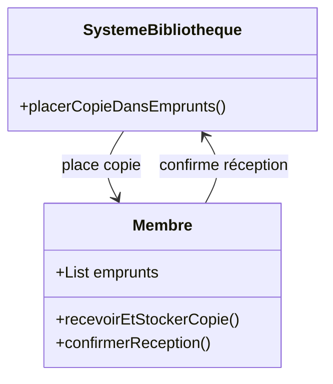

# L'œuvre empruntée ou louée est placée dans le répertoire "emprunts" du membre.

## Diagramme de séquence

```mermaid
sequenceDiagram
    participant Systeme as Système de Bibliothèque
    participant Membre as Membre

    Systeme->>Membre: Place la copie chiffrée dans le répertoire 'Emprunts'
    activate Membre
    Note right of Membre: Réception et stockage de la copie
    Membre-->>Systeme: Confirmation de réception
    deactivate Membre
```

## Diagramme de classe

```mermaid
classDiagram
    class SystemeBibliotheque {
        +placerCopieDansEmprunts()
    }
    class Membre {
        +List emprunts
        +recevoirEtStockerCopie()
        +confirmerReception()
    }

    SystemeBibliotheque --> Membre : place copie
    Membre --> SystemeBibliotheque : confirme réception
```
