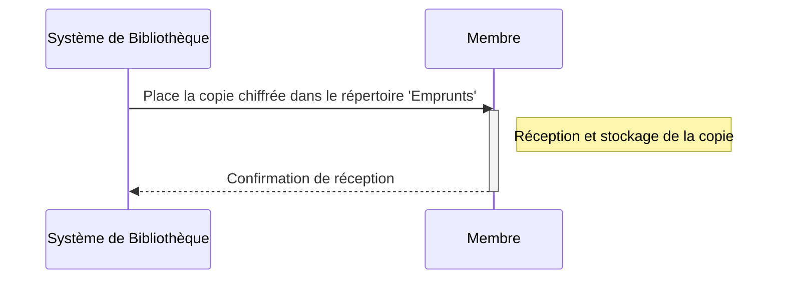
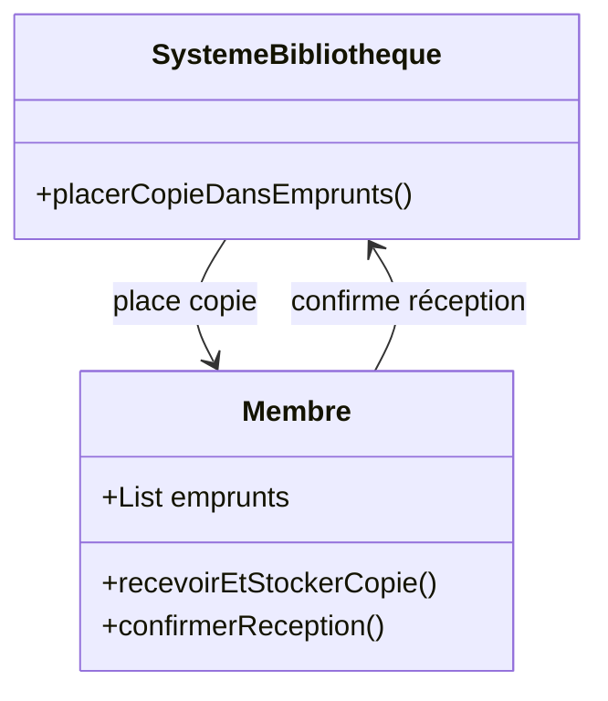

# L'œuvre empruntée ou louée est placée dans le répertoire "emprunts" du membre.

## Description du Scénario : Placement dans le Répertoire 'Emprunts'

### Acteurs Impliqués :
1. **Système de Bibliothèque** : Plateforme numérique qui gère le placement des œuvres dans les répertoires des membres.
2. **Membre** : Utilisateur de la bibliothèque numérique qui a emprunté ou loué une œuvre.

### Processus :
1. **Réception de la Copie Chiffrée** :
   - Après la génération de la copie chiffrée d'une œuvre, le Membre la reçoit via le Système de Bibliothèque.

2. **Placement de l'Œuvre dans le Répertoire 'Emprunts'** :
   - Le Système de Bibliothèque place automatiquement la copie chiffrée dans le répertoire 'emprunts' du profil du Membre.
   - Ce répertoire contient toutes les œuvres actuellement empruntées ou louées par le Membre.

3. **Accès et Lecture de l'Œuvre** :
   - Le Membre accède à l'œuvre dans son répertoire 'emprunts' et peut la lire ou la consulter pendant la période d'emprunt ou de location.

4. **Mise à Jour de l'État de l'Œuvre** :
   - Le Système de Bibliothèque met à jour l'état de l'œuvre dans la Base de Données, indiquant qu'elle est actuellement empruntée ou louée par le Membre.

### Diagramme de Séquence :
- Les interactions débutent avec le placement de la copie chiffrée de l'œuvre dans le répertoire 'emprunts' du Membre par le Système de Bibliothèque.
- Le Membre accède ensuite à l'œuvre dans son répertoire.

### Diagramme de Classe :
- **Classe Système de Bibliothèque** : Contient des méthodes pour placer les œuvres dans les répertoires des membres et gérer l'état des œuvres.
- **Classe Membre** : Gère son propre répertoire 'emprunts' et accède aux œuvres qu'il contient.

### Points Clés pour le Codage des Diagrammes :
- Les interactions entre le Système de Bibliothèque et le Membre doivent être clairement représentées.
- La classe Système de Bibliothèque doit avoir des méthodes spécifiques pour gérer le placement des œuvres dans les répertoires des membres.
- Le diagramme de séquence doit illustrer l'ordre des étapes et les interactions pour le placement de l'œuvre dans le répertoire 'emprunts'.

## Diagramme de séquence

## Diagramme de classe

