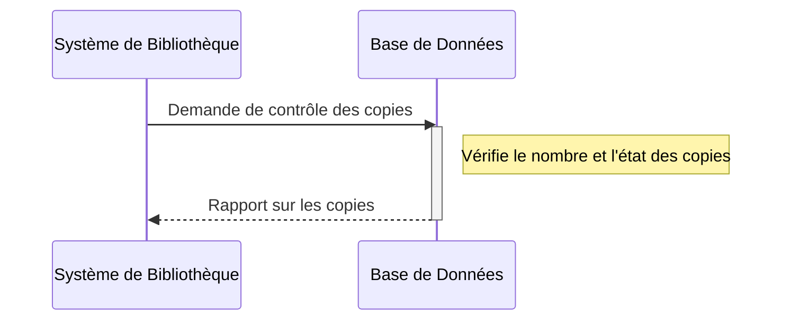
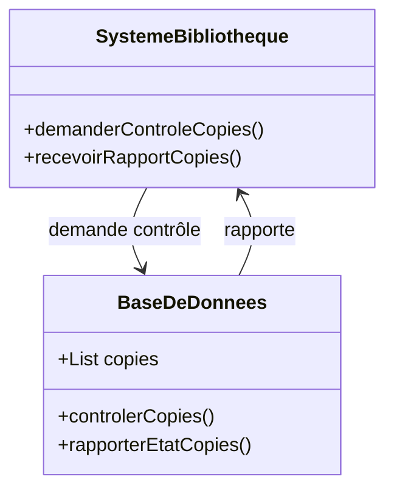

# Chaque membre peut avoir un maximum de trois copies d'une œuvre sous droits par licence d'exploitation.

## Diagramme de séquence

```mermaid
sequenceDiagram
    participant Systeme as Système de Bibliothèque
    participant BaseDeDonnees as Base de Données

    Systeme->>BaseDeDonnees: Demande de contrôle des copies
    activate BaseDeDonnees
    Note right of BaseDeDonnees: Vérifie le nombre et l'état des copies
    BaseDeDonnees-->>Systeme: Rapport sur les copies
    deactivate BaseDeDonnees
```

## Diagramme de classe

```mermaid
classDiagram
    class SystemeBibliotheque {
        +demanderControleCopies()
        +recevoirRapportCopies()
    }
    class BaseDeDonnees {
        +List copies
        +controlerCopies()
        +rapporterEtatCopies()
    }

    SystemeBibliotheque --> BaseDeDonnees : demande contrôle
    BaseDeDonnees --> SystemeBibliotheque : rapporte
```
