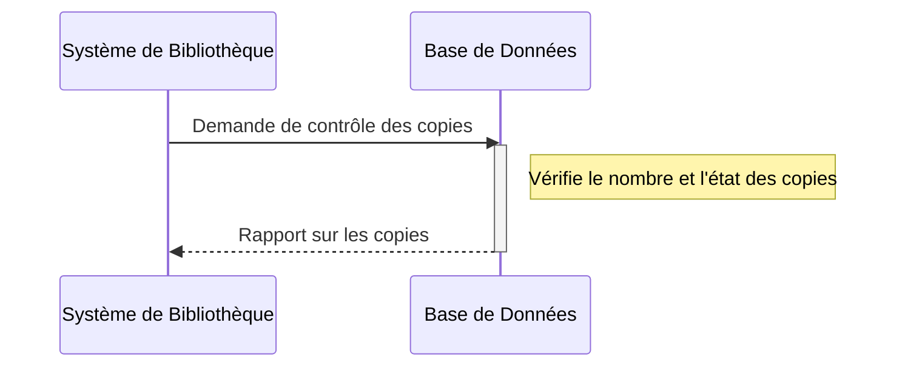
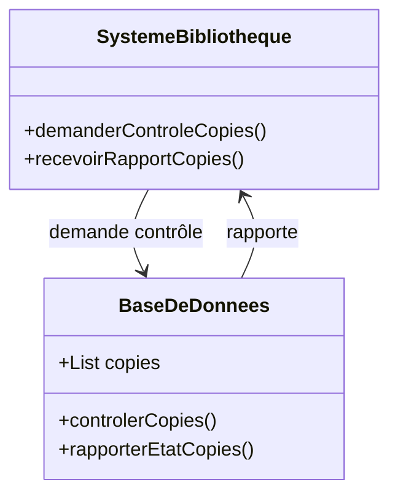

# Chaque membre peut avoir un maximum de trois copies d'une œuvre sous droits par licence d'exploitation.

## Description du Scénario : Contrôle des Copies

### Acteurs Impliqués :
1. **Système de Bibliothèque** : Plateforme numérique qui gère le contrôle des copies des œuvres.
2. **Base de Données** : Stocke les informations des œuvres, y compris le nombre et l'état des copies.

### Processus :
1. **Déclenchement du Contrôle des Copies** :
   - Le Système de Bibliothèque initie régulièrement un contrôle des copies des œuvres pour s'assurer de leur conformité avec les règles de la bibliothèque.

2. **Vérification du Nombre de Copies** :
   - Le Système de Bibliothèque vérifie le nombre de copies de chaque œuvre, en particulier pour celles sous droits d'auteur.
   - Il s'assure que le nombre de copies ne dépasse pas le nombre autorisé par les licences d'exploitation.

3. **Vérification de la Validité des Copies** :
   - Pour les œuvres louées, le Système de Bibliothèque vérifie que les copies chiffrées n'ont pas dépassé leur date de validité.

4. **Mise à Jour de la Base de Données** :
   - Après le contrôle, le Système de Bibliothèque met à jour la Base de Données avec les informations actuelles sur le nombre et l'état des copies.

### Diagramme de Séquence :
- Les interactions débutent avec le Système de Bibliothèque qui initie le contrôle des copies.
- Le Système de Bibliothèque interagit avec la Base de Données pour la mise à jour des informations sur les copies.

### Diagramme de Classe :
- **Classe Système de Bibliothèque** : Contient des méthodes pour initier le contrôle des copies et interagir avec la Base de Données.
- **Classe Base de Données** : Stocke les informations sur le nombre et l'état des copies des œuvres.

### Points Clés pour le Codage des Diagrammes :
- Les interactions entre le Système de Bibliothèque et la Base de Données doivent être clairement représentées.
- La classe Système de Bibliothèque doit avoir des méthodes spécifiques pour le contrôle des copies et la mise à jour des informations.
- Le diagramme de séquence doit illustrer l'ordre des étapes et les interactions pour le contrôle des copies des œuvres.

## Diagramme de séquence

## Diagramme de classe

