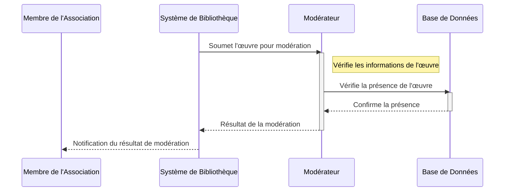
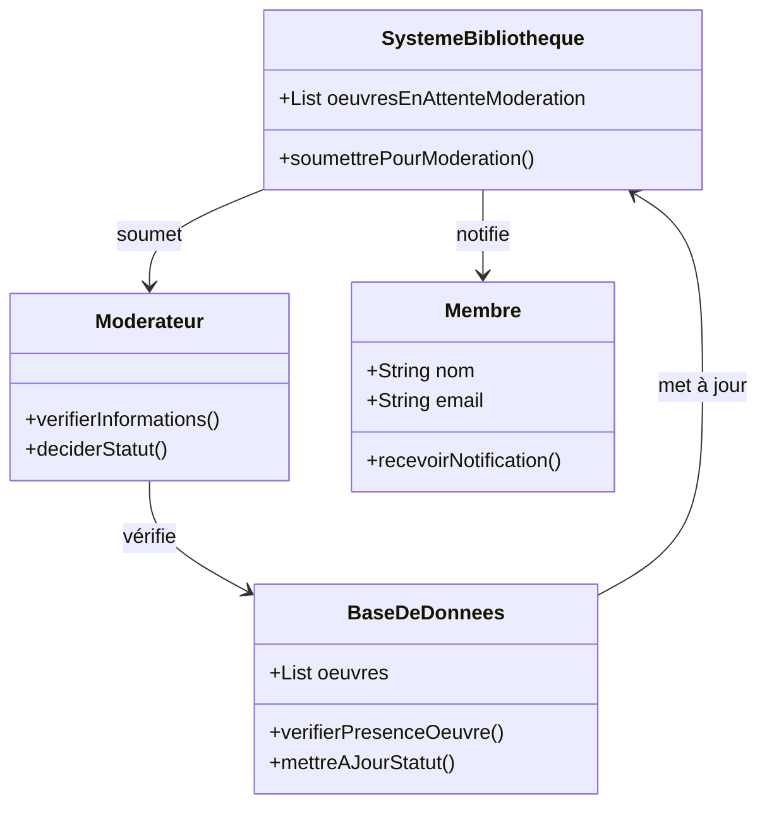

# L'œuvre proposée est placée dans le répertoire "à modérer" en attendant la vérification.

## Description du Scénario : Modération Initiale

### Acteurs Impliqués :
1. **Bibliothécaire** : Responsable de la modération des œuvres proposées.
2. **Système de Bibliothèque** : Plateforme numérique qui gère les propositions d'œuvres et leur modération.
3. **Base de Données** : Stocke les informations des œuvres et leur statut de modération.

### Processus :
1. **Réception de la Proposition d'Œuvre** :
   - Le Système de Bibliothèque reçoit la proposition d'œuvre d'un membre et la place dans la file d'attente de modération.

2. **Examen par le Bibliothécaire** :
   - Le Bibliothécaire accède au Système de Bibliothèque pour examiner les œuvres en attente de modération.
   - Il consulte les fichiers numériques et les informations JSON associées à chaque œuvre.

3. **Vérification et Complétion des Informations** :
   - Le Bibliothécaire vérifie les informations fournies (auteurs, éditeur, langue, etc.).
   - Il complète ou corrige les informations si nécessaire.

4. **Décision sur le Statut de l'Œuvre** :
   - Le Bibliothécaire décide si l'œuvre est dans le domaine public ou sous droits d'auteur.
   - Il peut également rejeter l'œuvre si elle ne répond pas aux critères.

5. **Mise à Jour de la Base de Données** :
   - Le Système de Bibliothèque met à jour le statut de l'œuvre dans la Base de Données en fonction de la décision du Bibliothécaire.

### Diagramme de Séquence :
- Les interactions débutent avec le Système de Bibliothèque qui présente les œuvres au Bibliothécaire.
- Le Bibliothécaire interagit avec le Système de Bibliothèque pour la vérification et la mise à jour des informations.

### Diagramme de Classe :
- **Classe Bibliothécaire** : Contient des méthodes pour examiner, vérifier et décider du statut des œuvres.
- **Classe Système de Bibliothèque** : Gère la présentation des œuvres pour la modération et communique avec la Base de Données.
- **Classe Base de Données** : Stocke les informations des œuvres et gère leur statut de modération.

### Points Clés pour le Codage des Diagrammes :
- Assurez-vous que les interactions entre le Bibliothécaire, le Système de Bibliothèque et la Base de Données sont clairement définies.
- Chaque classe doit avoir des attributs et des méthodes appropriés pour refléter leur rôle dans le processus de modération.
- Le diagramme de séquence doit illustrer l'ordre des étapes et les interactions entre les différents acteurs.

## Diagramme de séquence

## Diagramme de classe 

