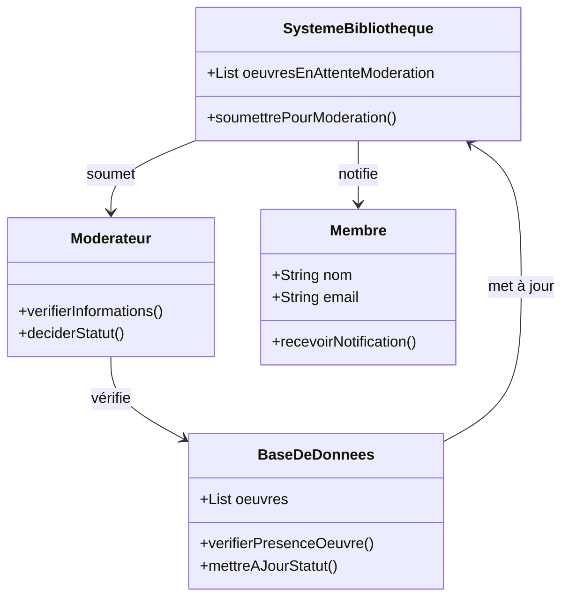

# L'œuvre proposée est placée dans le répertoire "à modérer" en attendant la vérification.

## Diagramme de classe 

```mermaid

classDiagram
    class SystemeBibliotheque {
        +List oeuvresEnAttenteModeration
        +soumettrePourModeration()
    }
    class Moderateur {
        +verifierInformations()
        +deciderStatut()
    }
    class BaseDeDonnees {
        +List oeuvres
        +verifierPresenceOeuvre()
        +mettreAJourStatut()
    }
    class Membre {
        +String nom
        +String email
        +recevoirNotification()
    }

    SystemeBibliotheque --> Moderateur : soumet
    Moderateur --> BaseDeDonnees : vérifie
    BaseDeDonnees --> SystemeBibliotheque : met à jour
    SystemeBibliotheque --> Membre : notifie

```

