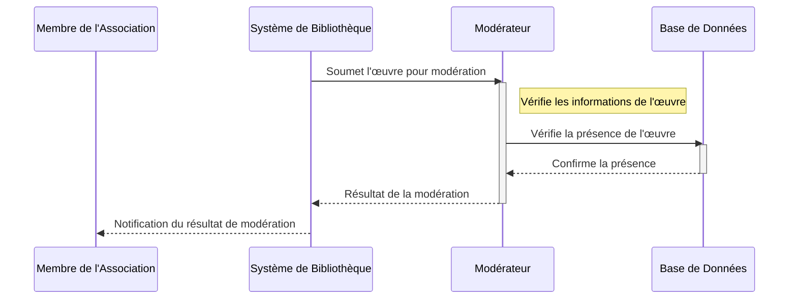
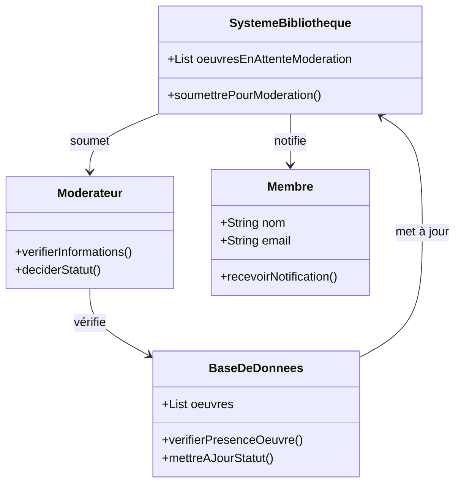

# L'œuvre proposée est placée dans le répertoire "à modérer" en attendant la vérification.
## Diagramme de séquence

```mermaid

sequenceDiagram
    participant Membre as Membre de l'Association
    participant Systeme as Système de Bibliothèque
    participant Moderateur as Modérateur
    participant BaseDeDonnees as Base de Données

    Systeme->>Moderateur: Soumet l'œuvre pour modération
    activate Moderateur
    Note right of Moderateur: Vérifie les informations de l'œuvre
    Moderateur->>BaseDeDonnees: Vérifie la présence de l'œuvre
    activate BaseDeDonnees
    BaseDeDonnees-->>Moderateur: Confirme la présence
    deactivate BaseDeDonnees
    Moderateur-->>Systeme: Résultat de la modération
    deactivate Moderateur
    Systeme-->>Membre: Notification du résultat de modération
```

## Diagramme de classe 

```mermaid

classDiagram
    class SystemeBibliotheque {
        +List oeuvresEnAttenteModeration
        +soumettrePourModeration()
    }
    class Moderateur {
        +verifierInformations()
        +deciderStatut()
    }
    class BaseDeDonnees {
        +List oeuvres
        +verifierPresenceOeuvre()
        +mettreAJourStatut()
    }
    class Membre {
        +String nom
        +String email
        +recevoirNotification()
    }

    SystemeBibliotheque --> Moderateur : soumet
    Moderateur --> BaseDeDonnees : vérifie
    BaseDeDonnees --> SystemeBibliotheque : met à jour
    SystemeBibliotheque --> Membre : notifie
```

