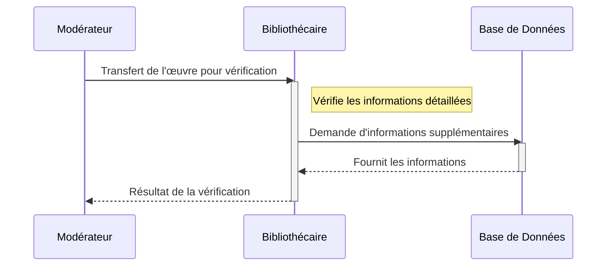
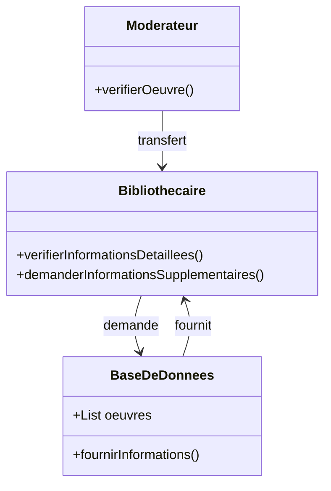

# Les bibliothécaires examinent l'œuvre soumise, vérifiant et complétant les informations associées.

## Diagramme de séquence

```mermaid

sequenceDiagram
    participant Moderateur as Modérateur
    participant Bibliothequaire as Bibliothécaire
    participant BaseDeDonnees as Base de Données

    Moderateur->>Bibliothequaire: Transfert de l'œuvre pour vérification
    activate Bibliothequaire
    Note right of Bibliothequaire: Vérifie les informations détaillées
    Bibliothequaire->>BaseDeDonnees: Demande d'informations supplémentaires
    activate BaseDeDonnees
    BaseDeDonnees-->>Bibliothequaire: Fournit les informations
    deactivate BaseDeDonnees
    Bibliothequaire-->>Moderateur: Résultat de la vérification
    deactivate Bibliothequaire

```

## Diagramme de classe

```mermaid

classDiagram
    class Moderateur {
        +verifierOeuvre()
    }
    class Bibliothecaire {
        +verifierInformationsDetaillees()
        +demanderInformationsSupplementaires()
    }
    class BaseDeDonnees {
        +List oeuvres
        +fournirInformations()
    }

    Moderateur --> Bibliothecaire : transfert
    Bibliothecaire --> BaseDeDonnees : demande
    BaseDeDonnees --> Bibliothecaire : fournit
```
