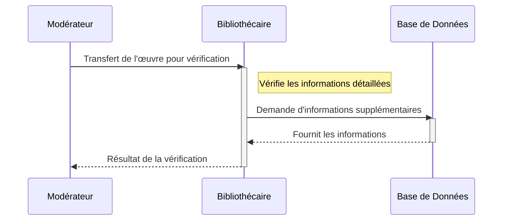
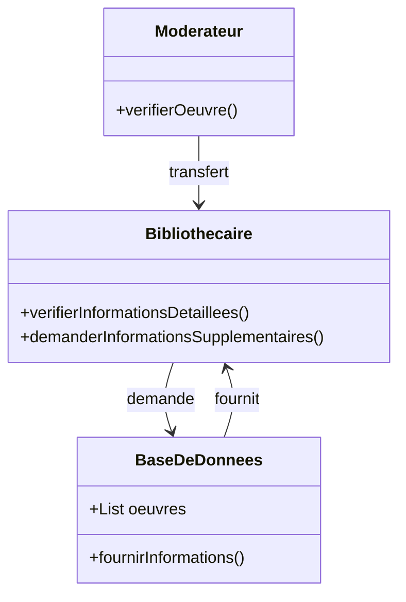

# Les bibliothécaires examinent l'œuvre soumise, vérifiant et complétant les informations associées.

## Description du Scénario : Vérification par les Bibliothécaires

### Acteurs Impliqués :
1. **Bibliothécaire** : Chargé de la vérification finale des œuvres modérées.
2. **Système de Bibliothèque** : Plateforme numérique qui gère les œuvres et leur processus de vérification.
3. **Base de Données** : Contient les informations détaillées et le statut des œuvres.

### Processus :
1. **Sélection des Œuvres Modérées** :
   - Le Bibliothécaire accède au Système de Bibliothèque pour examiner les œuvres récemment modérées.
   - Il sélectionne les œuvres pour une vérification finale.

2. **Examen Détaillé des Informations** :
   - Le Bibliothécaire examine en détail les informations de chaque œuvre (auteurs, éditeur, langue, pays d'origine, etc.).
   - Il vérifie l'exactitude et la complétude des informations.

3. **Confirmation ou Correction des Informations** :
   - Si les informations sont correctes, le Bibliothécaire les confirme.
   - Si des corrections sont nécessaires, il les apporte directement dans le Système de Bibliothèque.

4. **Mise à Jour de la Base de Données** :
   - Après la vérification, le Système de Bibliothèque met à jour la Base de Données avec les informations confirmées ou corrigées.

### Diagramme de Séquence :
- Les interactions débutent avec le Bibliothécaire qui sélectionne et examine les œuvres dans le Système de Bibliothèque.
- Le Système de Bibliothèque interagit avec la Base de Données pour la mise à jour des informations.

### Diagramme de Classe :
- **Classe Bibliothécaire** : Contient des méthodes pour examiner, confirmer ou corriger les informations des œuvres.
- **Classe Système de Bibliothèque** : Gère la présentation et la mise à jour des informations des œuvres.
- **Classe Base de Données** : Stocke les informations détaillées des œuvres et leur statut.

### Points Clés pour le Codage des Diagrammes :
- Les interactions entre le Bibliothécaire, le Système de Bibliothèque et la Base de Données doivent être clairement représentées.
- Chaque classe doit avoir des attributs et des méthodes spécifiques pour leur rôle dans le processus de vérification.
- Le diagramme de séquence doit illustrer l'ordre des étapes et les interactions entre les acteurs.

## Diagramme de séquence

## Diagramme de classe

