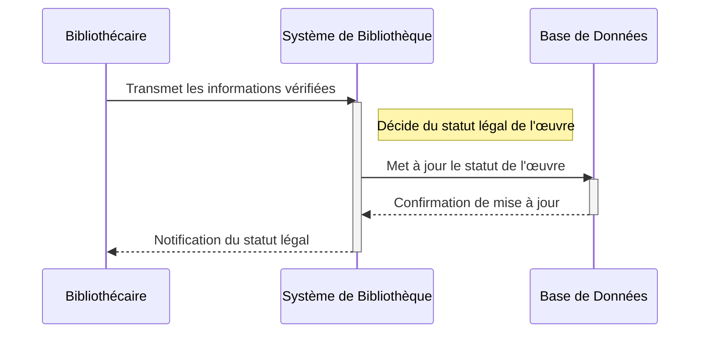
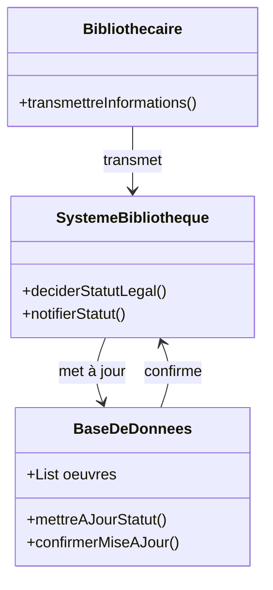

# Après vérification, les bibliothécaires décident du statut légal de l'œuvre (domaine public ou sous droits).

## Description du Scénario : Décision du Statut Légal

### Acteurs Impliqués :
1. **Bibliothécaire** : Responsable de la décision finale sur le statut légal des œuvres.
2. **Système de Bibliothèque** : Plateforme numérique qui gère les informations des œuvres et leur statut légal.
3. **Base de Données** : Stocke les informations des œuvres et leur statut légal.

### Processus :
1. **Examen Final des Œuvres** :
   - Le Bibliothécaire examine les œuvres après leur vérification pour décider de leur statut légal.
   - Il prend en compte les informations telles que la date de publication, les droits d'auteur, et si l'œuvre est dans le domaine public ou non.

2. **Décision sur le Statut Légal** :
   - Pour chaque œuvre, le Bibliothécaire décide si elle est dans le domaine public ou sous droits d'auteur.
   - Il peut également rejeter l'œuvre si elle ne répond pas aux critères de la bibliothèque.

3. **Mise à Jour de la Base de Données** :
   - Le Système de Bibliothèque met à jour le statut légal de chaque œuvre dans la Base de Données en fonction de la décision du Bibliothécaire.

### Diagramme de Séquence :
- Les interactions débutent avec le Bibliothécaire qui examine et décide du statut légal des œuvres dans le Système de Bibliothèque.
- Le Système de Bibliothèque interagit avec la Base de Données pour la mise à jour du statut légal.

### Diagramme de Classe :
- **Classe Bibliothécaire** : Contient des méthodes pour examiner les œuvres et décider de leur statut légal.
- **Classe Système de Bibliothèque** : Gère la présentation des œuvres et la mise à jour de leur statut légal.
- **Classe Base de Données** : Stocke les informations des œuvres et leur statut légal.

### Points Clés pour le Codage des Diagrammes :
- Les interactions entre le Bibliothécaire, le Système de Bibliothèque et la Base de Données doivent être clairement définies.
- Chaque classe doit avoir des attributs et des méthodes appropriés pour leur rôle dans le processus de décision du statut légal.
- Le diagramme de séquence doit illustrer l'ordre des étapes et les interactions entre les différents acteurs.

## Diagramme de séquence

## Diagramme de classe

