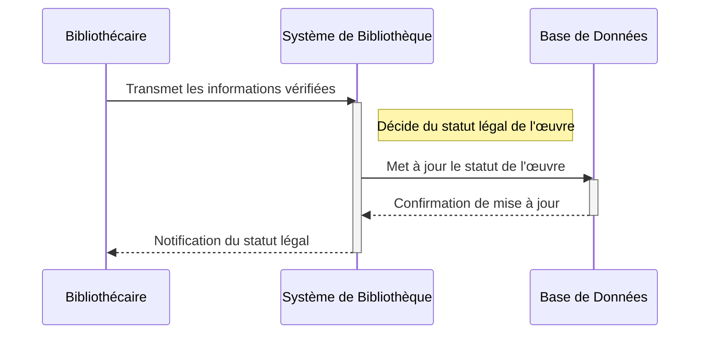
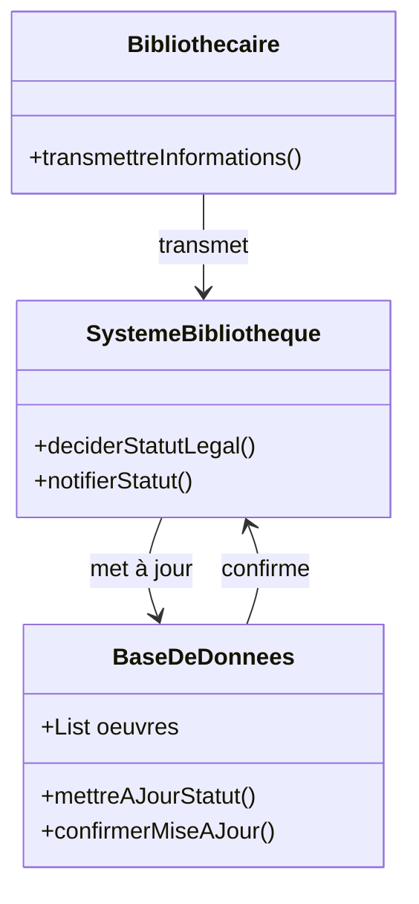

# Après vérification, les bibliothécaires décident du statut légal de l'œuvre (domaine public ou sous droits).

## Diagramme de séquence

```mermaid

sequenceDiagram
    participant Bibliothequaire as Bibliothécaire
    participant Systeme as Système de Bibliothèque
    participant BaseDeDonnees as Base de Données

    Bibliothequaire->>Systeme: Transmet les informations vérifiées
    activate Systeme
    Note right of Systeme: Décide du statut légal de l'œuvre
    Systeme->>BaseDeDonnees: Met à jour le statut de l'œuvre
    activate BaseDeDonnees
    BaseDeDonnees-->>Systeme: Confirmation de mise à jour
    deactivate BaseDeDonnees
    Systeme-->>Bibliothequaire: Notification du statut légal
    deactivate Systeme
```

## Diagramme de classe

```mermaid

classDiagram
    class Bibliothecaire {
        +transmettreInformations()
    }
    class SystemeBibliotheque {
        +deciderStatutLegal()
        +notifierStatut()
    }
    class BaseDeDonnees {
        +List oeuvres
        +mettreAJourStatut()
        +confirmerMiseAJour()
    }

    Bibliothecaire --> SystemeBibliotheque : transmet
    SystemeBibliotheque --> BaseDeDonnees : met à jour
    BaseDeDonnees --> SystemeBibliotheque : confirme

```
