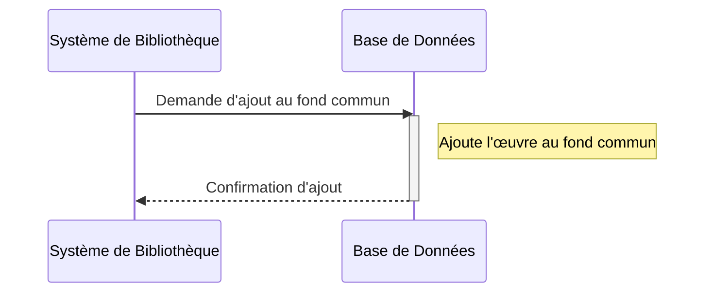
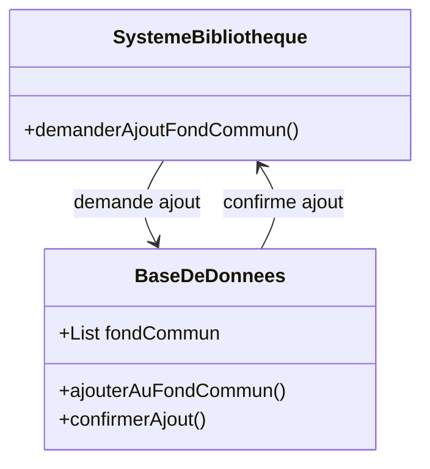

# Si l'œuvre est dans le domaine public, elle est ajoutée au répertoire "fond_commun" et devient accessible gratuitement à tous les membres.

## Diagramme de séquence

```mermaid

sequenceDiagram
    participant Systeme as Système de Bibliothèque
    participant BaseDeDonnees as Base de Données

    Systeme->>BaseDeDonnees: Demande d'ajout au fond commun
    activate BaseDeDonnees
    Note right of BaseDeDonnees: Ajoute l'œuvre au fond commun
    BaseDeDonnees-->>Systeme: Confirmation d'ajout
    deactivate BaseDeDonnees
```

## Diagramme de classe

```mermaid

classDiagram
    class SystemeBibliotheque {
        +demanderAjoutFondCommun()
    }
    class BaseDeDonnees {
        +List fondCommun
        +ajouterAuFondCommun()
        +confirmerAjout()
    }

    SystemeBibliotheque --> BaseDeDonnees : demande ajout
    BaseDeDonnees --> SystemeBibliotheque : confirme ajout

```
