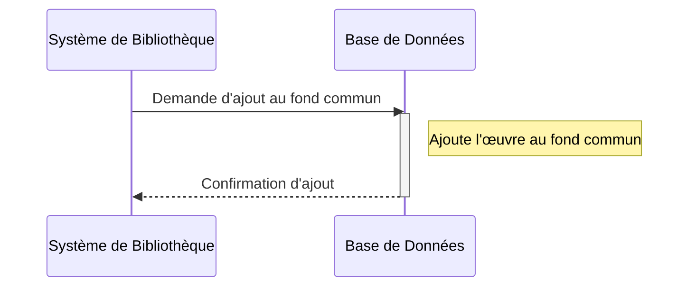
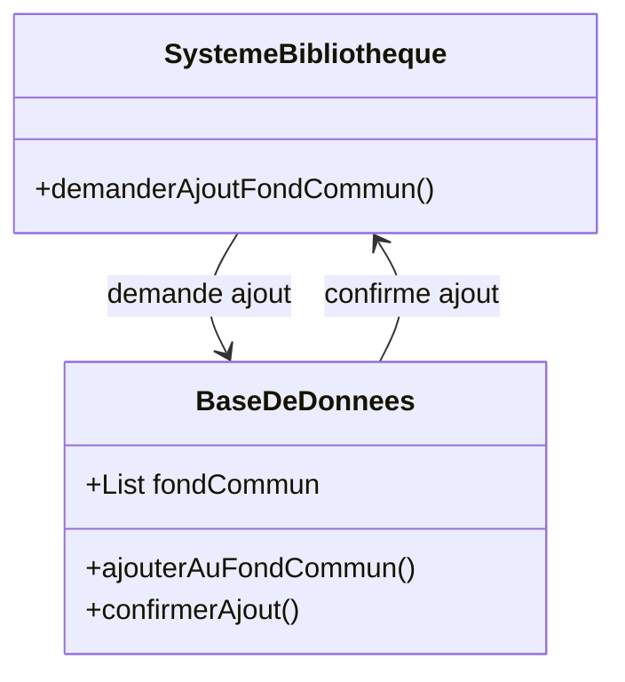

# Si l'œuvre est dans le domaine public, elle est ajoutée au répertoire "fond_commun" et devient accessible gratuitement à tous les membres.
## Description du Scénario : Ajout au Fond Commun

### Acteurs Impliqués :
1. **Système de Bibliothèque** : Plateforme numérique qui gère l'ajout des œuvres au fond commun.
2. **Base de Données** : Stocke les informations des œuvres et leur statut.

### Processus :
1. **Sélection des Œuvres pour le Fond Commun** :
   - Le Système de Bibliothèque identifie les œuvres qui ont été classées dans le domaine public par les bibliothécaires.

2. **Ajout des Œuvres au Fond Commun** :
   - Le Système de Bibliothèque transfère les œuvres sélectionnées dans le répertoire "fond_commun".
   - Ces œuvres sont désormais accessibles gratuitement à tous les membres.

3. **Mise à Jour de la Base de Données** :
   - Le Système de Bibliothèque met à jour la Base de Données pour refléter le nouvel emplacement et le statut d'accès des œuvres.

### Diagramme de Séquence :
- Les interactions débutent avec le Système de Bibliothèque qui sélectionne et déplace les œuvres dans le fond commun.
- Le Système de Bibliothèque interagit ensuite avec la Base de Données pour la mise à jour des informations.

### Diagramme de Classe :
- **Classe Système de Bibliothèque** : Contient des méthodes pour gérer le transfert des œuvres au fond commun et la mise à jour des informations.
- **Classe Base de Données** : Stocke les informations des œuvres, y compris leur emplacement et leur statut d'accès.

### Points Clés pour le Codage des Diagrammes :
- Les interactions entre le Système de Bibliothèque et la Base de Données doivent être clairement représentées.
- La classe Système de Bibliothèque doit avoir des méthodes spécifiques pour la gestion et la mise à jour des œuvres dans le fond commun.
- Le diagramme de séquence doit illustrer l'ordre des étapes et les interactions pour l'ajout des œuvres au fond commun.

## Diagramme de séquence

## Diagramme de classe

