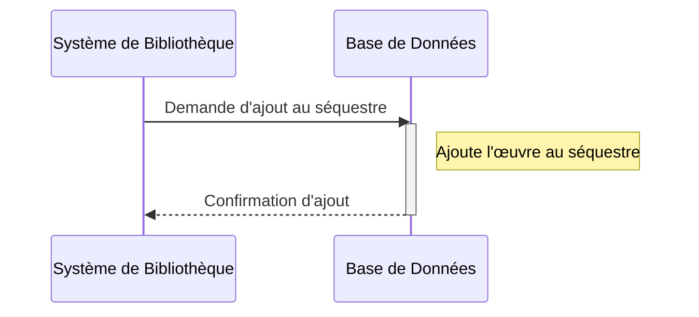
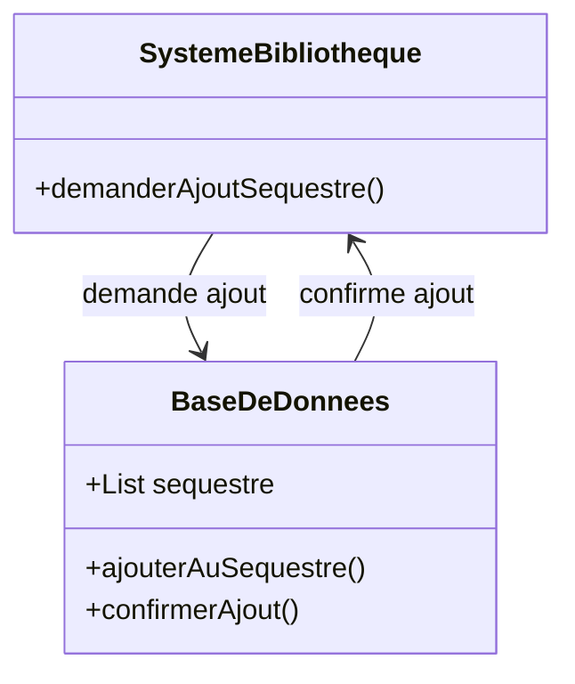

# Si l'œuvre est sous droits, elle est ajoutée au répertoire "séquestre" et est disponible pour location.

## Diagramme de séquence

```mermaid
sequenceDiagram
    participant Systeme as Système de Bibliothèque
    participant BaseDeDonnees as Base de Données

    Systeme->>BaseDeDonnees: Demande d'ajout au séquestre
    activate BaseDeDonnees
    Note right of BaseDeDonnees: Ajoute l'œuvre au séquestre
    BaseDeDonnees-->>Systeme: Confirmation d'ajout
    deactivate BaseDeDonnees
```

## Diagramme de classe

```mermaid

classDiagram
    class SystemeBibliotheque {
        +demanderAjoutSequestre()
    }
    class BaseDeDonnees {
        +List sequestre
        +ajouterAuSequestre()
        +confirmerAjout()
    }

    SystemeBibliotheque --> BaseDeDonnees : demande ajout
    BaseDeDonnees --> SystemeBibliotheque : confirme ajout
```
