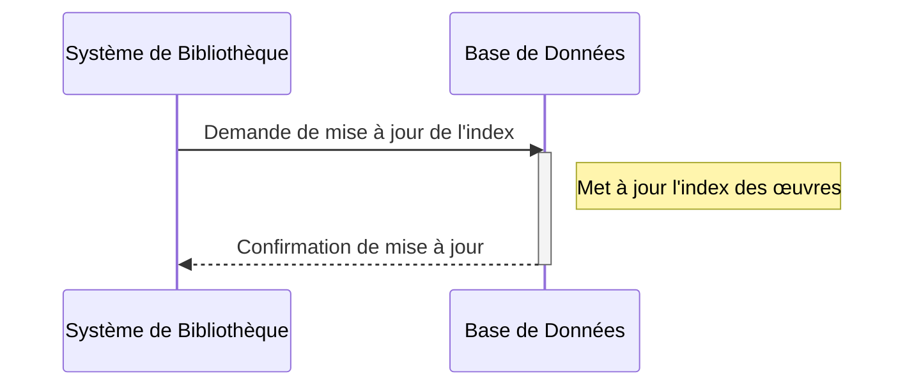
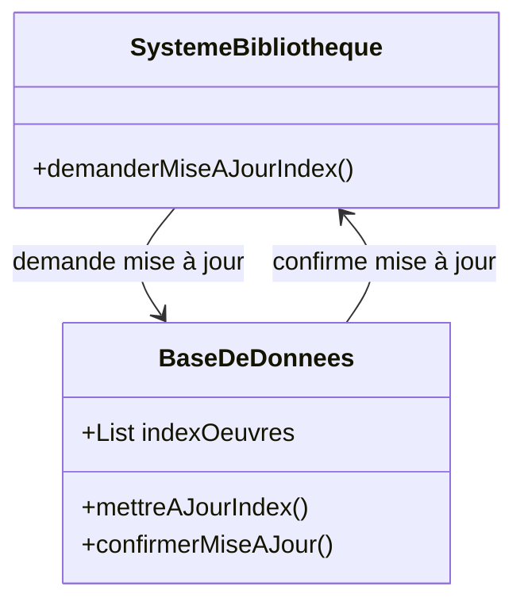

# L'index des œuvres est mis à jour pour refléter l'ajout de la nouvelle œuvre.
## Description du Scénario : Mise à Jour de l'Index

### Acteurs Impliqués :
1. **Système de Bibliothèque** : Plateforme numérique qui gère la mise à jour de l'index des œuvres.
2. **Base de Données** : Stocke les informations des œuvres et leur index.

### Processus :
1. **Détection des Changements dans les Œuvres** :
   - Le Système de Bibliothèque détecte toute addition, suppression ou modification des œuvres dans la bibliothèque numérique.

2. **Mise à Jour de l'Index** :
   - Le Système de Bibliothèque met à jour l'index des œuvres pour refléter les changements récents.
   - Cela inclut la mise à jour des informations telles que le titre, l'auteur, le statut d'accès, et l'emplacement des fichiers.

3. **Synchronisation avec la Base de Données** :
   - Après la mise à jour de l'index, le Système de Bibliothèque synchronise ces informations avec la Base de Données.

### Diagramme de Séquence :
- Les interactions débutent avec le Système de Bibliothèque qui détecte les changements et met à jour l'index.
- Le Système de Bibliothèque interagit ensuite avec la Base de Données pour synchroniser les informations mises à jour.

### Diagramme de Classe :
- **Classe Système de Bibliothèque** : Contient des méthodes pour détecter les changements dans les œuvres et mettre à jour l'index.
- **Classe Base de Données** : Stocke les informations des œuvres et leur index.

### Points Clés pour le Codage des Diagrammes :
- Les interactions entre le Système de Bibliothèque et la Base de Données doivent être clairement représentées.
- La classe Système de Bibliothèque doit avoir des méthodes spécifiques pour la détection des changements et la mise à jour de l'index.
- Le diagramme de séquence doit illustrer l'ordre des étapes et les interactions pour la mise à jour de l'index des œuvres.

## Diagramme de séquence

## Diagramme de classe

