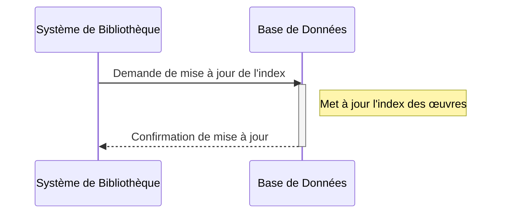
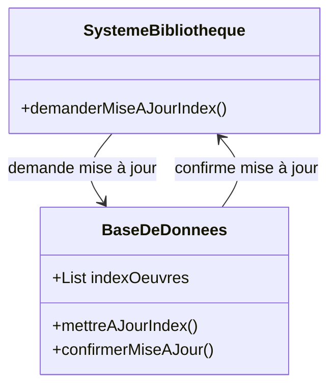

# L'index des œuvres est mis à jour pour refléter l'ajout de la nouvelle œuvre.

## Diagramme de séquence

```mermaid
sequenceDiagram
    participant Systeme as Système de Bibliothèque
    participant BaseDeDonnees as Base de Données

    Systeme->>BaseDeDonnees: Demande de mise à jour de l'index
    activate BaseDeDonnees
    Note right of BaseDeDonnees: Met à jour l'index des œuvres
    BaseDeDonnees-->>Systeme: Confirmation de mise à jour
    deactivate BaseDeDonnees
```

## Diagramme de classe

```mermaid
classDiagram
    class SystemeBibliotheque {
        +demanderMiseAJourIndex()
    }
    class BaseDeDonnees {
        +List indexOeuvres
        +mettreAJourIndex()
        +confirmerMiseAJour()
    }

    SystemeBibliotheque --> BaseDeDonnees : demande mise à jour
    BaseDeDonnees --> SystemeBibliotheque : confirme mise à jour
```
