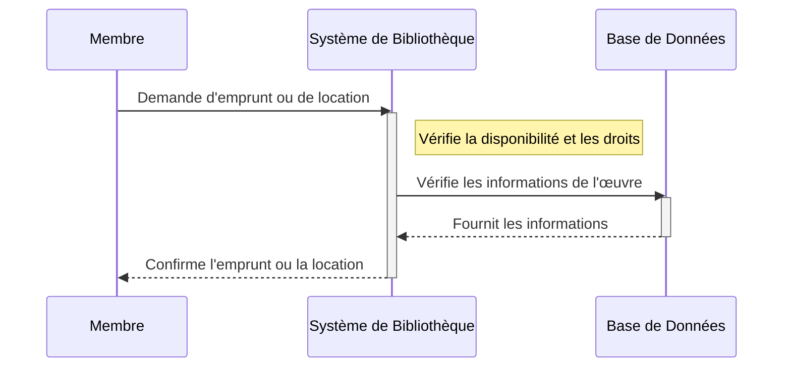
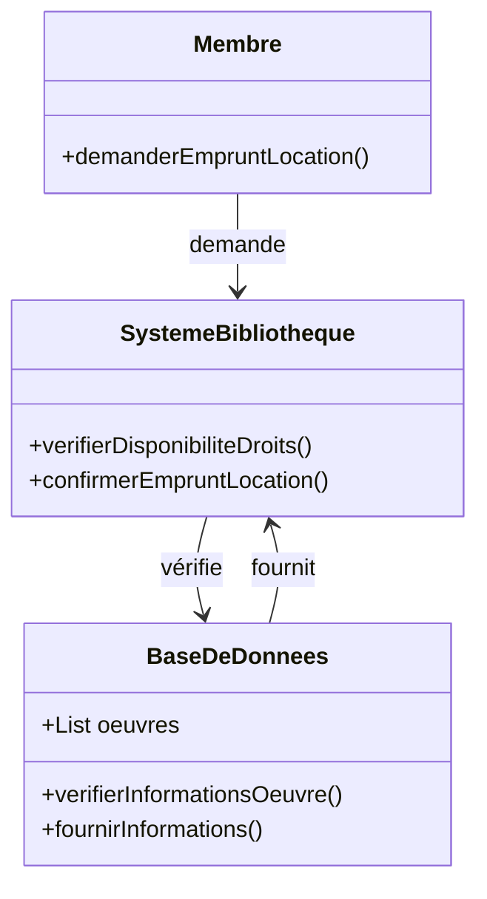

# Un membre choisit d'emprunter ou de louer une œuvre disponible.
## Description du Scénario : Emprunt ou Location par un Membre

### Acteurs Impliqués :
1. **Membre** : Utilisateur de la bibliothèque numérique souhaitant emprunter ou louer une œuvre.
2. **Système de Bibliothèque** : Plateforme numérique qui gère les emprunts et les locations.
3. **Base de Données** : Stocke les informations des œuvres et leur statut d'accès.

### Processus :
1. **Sélection de l'Œuvre par le Membre** :
   - Le Membre navigue dans le Système de Bibliothèque et sélectionne une œuvre à emprunter ou à louer.

2. **Vérification du Statut de l'Œuvre** :
   - Le Système de Bibliothèque vérifie si l'œuvre est dans le domaine public (gratuite) ou sous droits d'auteur (location).

3. **Processus d'Emprunt ou de Location** :
   - Si l'œuvre est dans le domaine public, le Membre peut l'emprunter gratuitement.
   - Si l'œuvre est sous droits d'auteur, le Membre procède à la location pour une période définie.

4. **Génération de la Copie Chiffrée** :
   - Pour les œuvres sous droits d'auteur, le Système de Bibliothèque génère une copie chiffrée de l'œuvre pour le Membre.

5. **Placement dans le Répertoire 'Emprunts'** :
   - L'œuvre empruntée ou louée est placée dans le répertoire 'emprunts' du Membre.

6. **Mise à Jour de la Base de Données** :
   - Le Système de Bibliothèque met à jour la Base de Données avec les informations de l'emprunt ou de la location.

### Diagramme de Séquence :
- Les interactions débutent avec le Membre qui sélectionne une œuvre à emprunter ou à louer.
- Le Système de Bibliothèque gère le processus d'emprunt ou de location et interagit avec la Base de Données pour la mise à jour.

### Diagramme de Classe :
- **Classe Membre** : Contient des méthodes pour sélectionner et emprunter/louer des œuvres.
- **Classe Système de Bibliothèque** : Gère le processus d'emprunt ou de location et la génération de copies chiffrées.
- **Classe Base de Données** : Stocke les informations des œuvres et les détails des emprunts/locations.

### Points Clés pour le Codage des Diagrammes :
- Les interactions entre le Membre, le Système de Bibliothèque et la Base de Données doivent être clairement représentées.
- La classe Système de Bibliothèque doit avoir des méthodes spécifiques pour gérer les emprunts et les locations, ainsi que la génération de copies chiffrées.
- Le diagramme de séquence doit illustrer l'ordre des étapes et les interactions pour l'emprunt ou la location d'une œuvre.

## Diagramme de séquence

## Diagramme de classe

