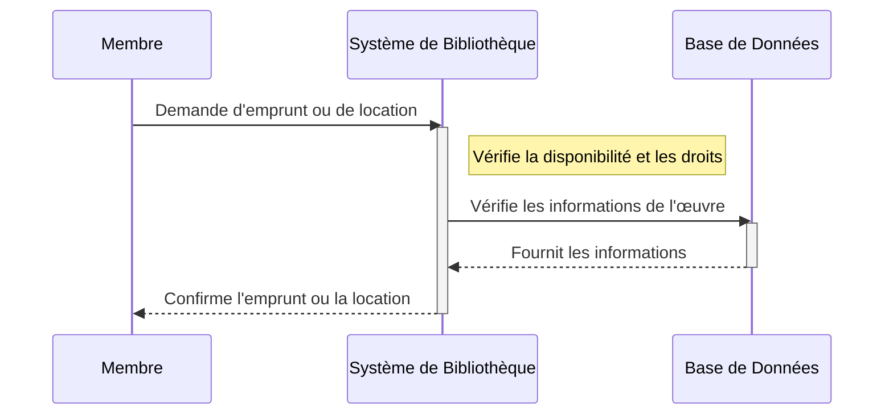
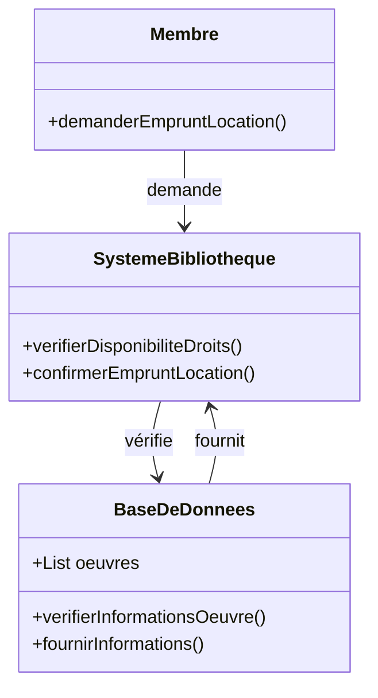

# Un membre choisit d'emprunter ou de louer une œuvre disponible.

## Diagramme de séquence

```mermaid
sequenceDiagram
    participant Membre as Membre
    participant Systeme as Système de Bibliothèque
    participant BaseDeDonnees as Base de Données

    Membre->>Systeme: Demande d'emprunt ou de location
    activate Systeme
    Note right of Systeme: Vérifie la disponibilité et les droits
    Systeme->>BaseDeDonnees: Vérifie les informations de l'œuvre
    activate BaseDeDonnees
    BaseDeDonnees-->>Systeme: Fournit les informations
    deactivate BaseDeDonnees
    Systeme-->>Membre: Confirme l'emprunt ou la location
    deactivate Systeme
```

## Diagramme de classe

```mermaid
classDiagram
    class Membre {
        +demanderEmpruntLocation()
    }
    class SystemeBibliotheque {
        +verifierDisponibiliteDroits()
        +confirmerEmpruntLocation()
    }
    class BaseDeDonnees {
        +List oeuvres
        +verifierInformationsOeuvre()
        +fournirInformations()
    }

    Membre --> SystemeBibliotheque : demande
    SystemeBibliotheque --> BaseDeDonnees : vérifie
    BaseDeDonnees --> SystemeBibliotheque : fournit
```
