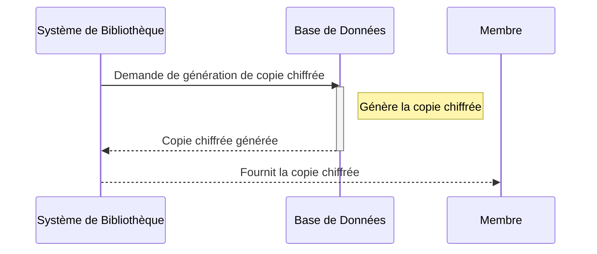
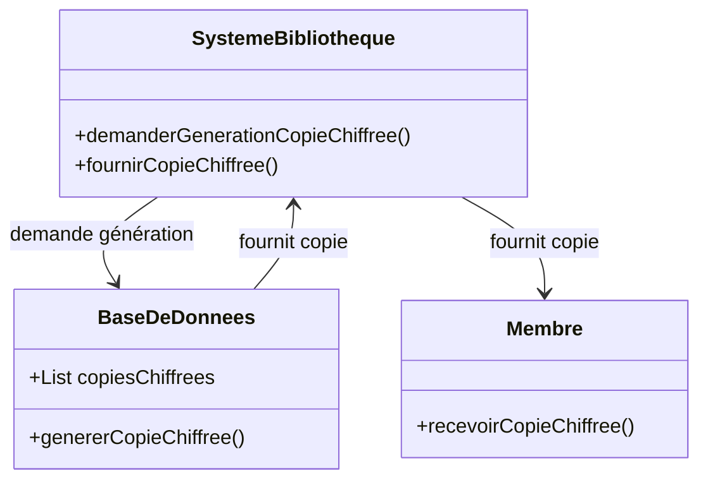

# Pour les œuvres louées, l'application génère une copie chiffrée avec une clé unique et une date d'expiration.

## Diagramme de séquence 

```mermaid
sequenceDiagram
    participant Systeme as Système de Bibliothèque
    participant BaseDeDonnees as Base de Données
    participant Membre as Membre

    Systeme->>BaseDeDonnees: Demande de génération de copie chiffrée
    activate BaseDeDonnees
    Note right of BaseDeDonnees: Génère la copie chiffrée
    BaseDeDonnees-->>Systeme: Copie chiffrée générée
    deactivate BaseDeDonnees
    Systeme-->>Membre: Fournit la copie chiffrée
```

## Diagrame de classe

```mermaid
classDiagram
    class SystemeBibliotheque {
        +demanderGenerationCopieChiffree()
        +fournirCopieChiffree()
    }
    class BaseDeDonnees {
        +genererCopieChiffree()
        +List copiesChiffrees
    }
    class Membre {
        +recevoirCopieChiffree()
    }

    SystemeBibliotheque --> BaseDeDonnees : demande génération
    BaseDeDonnees --> SystemeBibliotheque : fournit copie
    SystemeBibliotheque --> Membre : fournit copie
```
