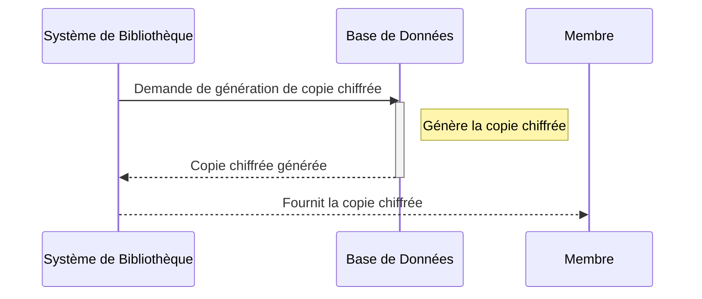
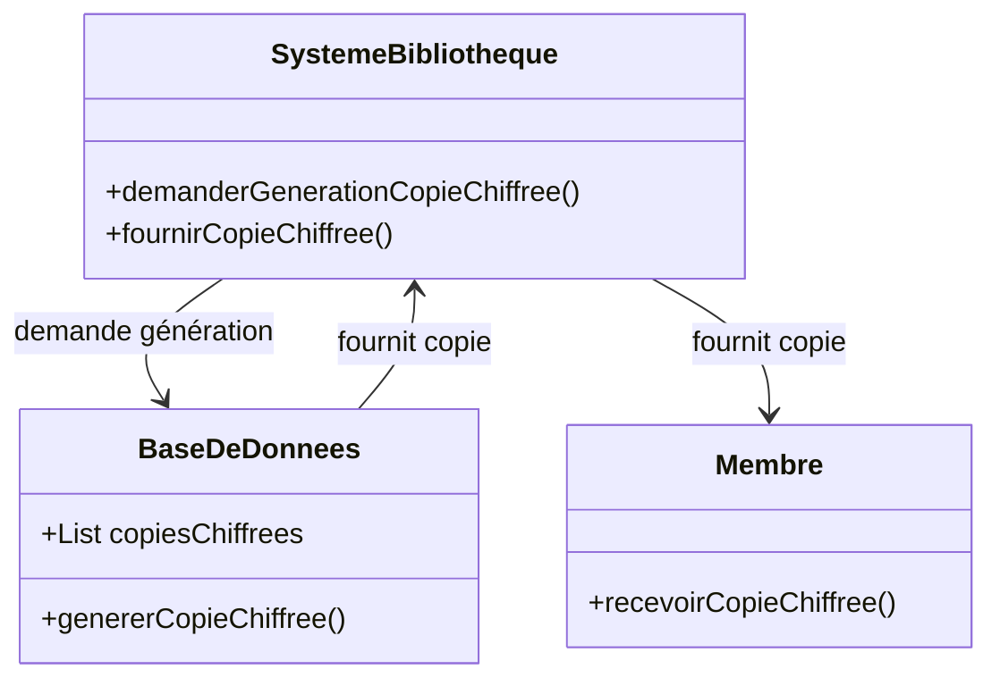

# Pour les œuvres louées, l'application génère une copie chiffrée avec une clé unique et une date d'expiration.
## Description du Scénario : Génération de Copie Chiffrée

### Acteurs Impliqués :
1. **Système de Bibliothèque** : Plateforme numérique qui gère la génération de copies chiffrées des œuvres.
2. **Membre** : Utilisateur de la bibliothèque numérique qui emprunte ou loue une œuvre sous droits d'auteur.
3. **Base de Données** : Stocke les informations des œuvres et leur statut d'accès.

### Processus :
1. **Demande de Copie Chiffrée** :
   - Lorsqu'un Membre emprunte ou loue une œuvre sous droits d'auteur, il déclenche la demande de création d'une copie chiffrée.

2. **Génération de la Copie Chiffrée** :
   - Le Système de Bibliothèque génère une copie chiffrée de l'œuvre, utilisant une clé de chiffrement unique pour le Membre.

3. **Attribution de la Date de Validité** :
   - Chaque copie chiffrée reçoit une date de validité, correspondant à la fin de la période d'emprunt ou de location.

4. **Placement dans le Répertoire 'Emprunts' du Membre** :
   - La copie chiffrée est placée dans le répertoire 'emprunts' du Membre.

5. **Mise à Jour de la Base de Données** :
   - Le Système de Bibliothèque met à jour la Base de Données avec les informations de la copie chiffrée et sa date de validité.

### Diagramme de Séquence :
- Les interactions débutent avec la demande de copie chiffrée par le Membre.
- Le Système de Bibliothèque gère la génération de la copie chiffrée et interagit avec la Base de Données pour la mise à jour.

### Diagramme de Classe :
- **Classe Système de Bibliothèque** : Contient des méthodes pour générer des copies chiffrées et gérer leur validité.
- **Classe Membre** : Reçoit et stocke la copie chiffrée dans son répertoire 'emprunts'.
- **Classe Base de Données** : Stocke les informations des copies chiffrées et leur date de validité.

### Points Clés pour le Codage des Diagrammes :
- Les interactions entre le Membre, le Système de Bibliothèque et la Base de Données doivent être clairement représentées.
- La classe Système de Bibliothèque doit avoir des méthodes spécifiques pour la génération de copies chiffrées et la gestion de leur validité.
- Le diagramme de séquence doit illustrer l'ordre des étapes et les interactions pour la génération de la copie chiffrée d'une œuvre.

## Diagramme de séquence 

## Diagrame de classe

